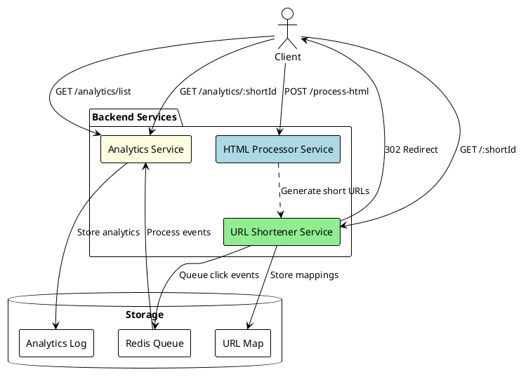

# Link Shortener System Architecture

## Components

### HTML Processor Service (`htmlProcessor.ts`)
- Receives raw HTML via POST endpoint
- Uses JSDOM to parse and process HTML
- Generates short IDs using UUID
- Replaces original URLs with short URLs
- Returns processed HTML to client

### URL Shortener Service (`shortenerRoutes.ts`)
- Handles redirect requests for short URLs
- Maintains URL mappings in memory
- Queues analytics events to Redis
- Returns 302 redirects to original URLs

### Analytics System (`analyticsRoutes.ts`, `analytics.ts`)
- Processes analytics events asynchronously via Bull queue
- Stores click data in memory (analyticsLog)
- Provides two API endpoints:
  - GET /analytics/list - All analytics
  - GET /analytics/:shortId - Analytics by short URL

## Data Flows
1. Client submits HTML for processing
2. HTML Processor extracts URLs and creates short versions
3. Short URLs are stored in URL Map
4. Client accesses short URL
5. System redirects to original URL
6. Click event is queued in Redis
7. Analytics service processes events from queue
8. Analytics data is stored and available via API

## Implementation Details
- Express.js for HTTP routing
- Bull + Redis for async event processing
- In-memory storage for URL mappings and analytics
- JSDOM for HTML parsing
- UUID for generating short IDs