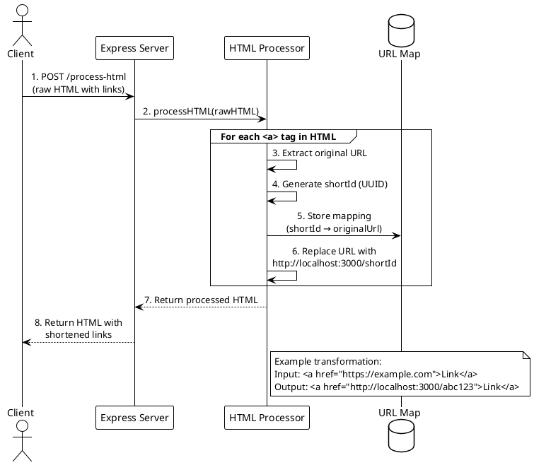
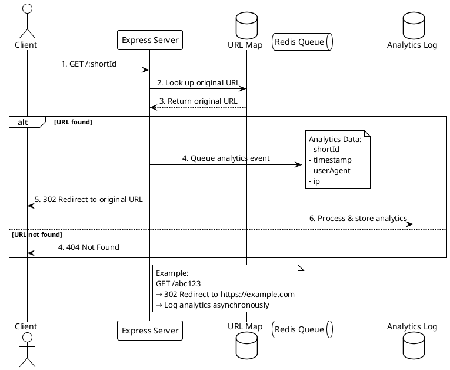

# Data Flow Documentation

## 1. HTML Processing Flow: Raw HTML to Shortened Links



### Key Implementation Points

1. **HTML Processing**
```typescript
// From htmlProcessor.ts
export function processHTML(rawHTML: string): string {
  const dom = new JSDOM(rawHTML);
  dom.window.document.querySelectorAll('a').forEach(anchor => {
    const originalUrl = anchor.href;
    const shortId = uuidv4().slice(0, 8);
    urlMap.set(shortId, originalUrl);
    anchor.href = `http://localhost:3000/${shortId}`;
  });
  return dom.serialize();
}
```

## 2. Link Click Flow: Click to Analytics and Redirect



### Key Implementation Points

1. **Link Click Handling**
```typescript
// From shortenerRoutes.ts
const handleShortUrl: RequestHandler<RequestParams> = async (req, res) => {
  const shortId = req.params.shortId;
  const originalUrl = urlMap.get(shortId);
  
  if (!originalUrl) return res.status(404).send('URL not found');
  
  await analyticsQueue.add({
    shortId,
    timestamp: new Date(),
    userAgent: req.headers['user-agent'] || 'unknown',
    ip: req.ip || ""
  });
  
  return res.redirect(302, originalUrl);
};
```

### Storage Details

1. **URL Storage**
- In-memory Map
- Key: 8-character UUID
- Value: Original URL

2. **Analytics Storage**
- Redis Queue for processing
- In-memory array for storage
- Asynchronous processing
- Retry logic for failed operations