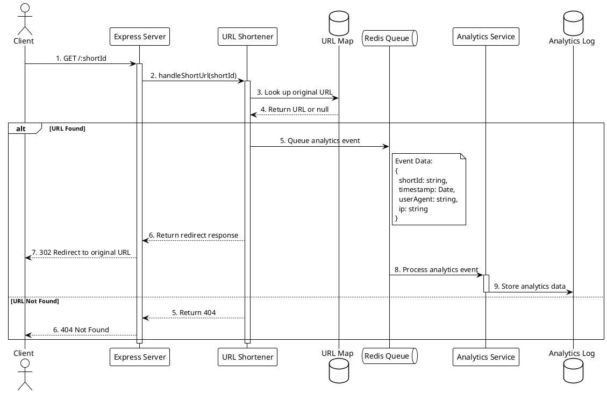

# Link Click Data Flow Documentation

## Link Click to Analytics and Redirect Flow



## Implementation Details

### 1. Route Handler (Express)
```typescript
router.get('/:shortId', handleShortUrl);
```

### 2. URL Lookup and Redirect
```typescript
const handleShortUrl: RequestHandler<RequestParams> = async (req, res) => {
  const shortId = req.params.shortId;
  const originalUrl = urlMap.get(shortId);

  if (!originalUrl) {
    return res.status(404).send('URL not found');
  }

  await analyticsQueue.add({
    shortId,
    timestamp: new Date(),
    userAgent: req.headers['user-agent'] || 'unknown',
    ip: req.ip || ""
  });

  return res.redirect(302, originalUrl);
};
```

### 3. Analytics Queue Processing
```typescript
analyticsQueue.process(async (job) => {
  const data: AnalyticsData = job.data;
  await logAnalytics(data);
});
```

### 4. Analytics Storage
```typescript
export function logAnalytics(event: AnalyticsEvent) {
  analyticsLog.push(event);
  console.log(`[Analytics] Logged click on ${event.shortId} from ${event.ip}`);
}
```

## Key Components

### Redis Queue Configuration
```typescript
const analyticsQueue = new Queue('analytics', {
  redis: {
    host: 'localhost',
    port: 6379,
    retryStrategy: (times: number) => {
      const delay = Math.min(times * 1000, 30000);
      console.log(`Retrying Redis connection in ${delay}ms...`);
      return delay;
    }
  }
});
```

### Analytics Data Structure
```typescript
interface AnalyticsData {
  shortId: string;    // The shortened URL identifier
  timestamp: Date;    // When the link was clicked
  userAgent: string;  // Browser/client information
  ip: string;        // Client IP address
}
```

## Error Handling

1. **Invalid Short URLs**
   - Returns 404 if shortId not found
   - No analytics event is generated

2. **Queue Processing Failures**
   - Exponential backoff retry strategy
   - Maximum retry delay: 30 seconds
   - Logs retry attempts

3. **Redis Connection Issues**
   - Automatic reconnection attempts
   - Progressive delay between attempts
   - Connection status logging

## Performance Considerations

1. **Asynchronous Processing**
   - Analytics handled separately from redirect
   - User experience not impacted by analytics processing
   - Redis queue ensures no data loss

2. **Memory Usage**
   - In-memory URL map for fast lookups
   - Queue prevents memory overflow from high traffic
   - Analytics stored in scalable storage

3. **Scalability**
   - Queue-based architecture allows horizontal scaling
   - Independent scaling of redirect and analytics services
   - Redis provides reliable message handling