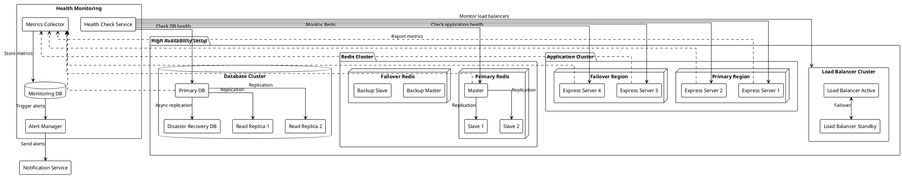

# Fault Tolerance & Monitoring Architecture



## Fault Tolerance Strategies

### 1. Load Balancer Failover
- Active-standby load balancer configuration
- Automatic failover if primary fails
- Health checks for backend services

### 2. Application Redundancy
- Multiple application instances
- Cross-region deployment
- Automatic instance replacement

### 3. Data Redundancy
- Redis master-slave replication
- Database read replicas
- Cross-region disaster recovery

### 4. Circuit Breaking
```typescript
interface CircuitBreakerConfig {
  failureThreshold: 5,
  resetTimeout: 30000, // 30 seconds
  monitorInterval: 5000 // 5 seconds
}
```

## Monitoring Strategy

### 1. Health Checks
- Application liveness
- Redis connectivity
- Database connections
- Queue processing

### 2. Metrics Collection
- Request latency
- Error rates
- Queue sizes
- Resource utilization
- Cache hit rates

### 3. Alerting
- Service degradation
- High error rates
- Resource exhaustion
- Replication lag

### 4. Logging
- Centralized logging
- Error tracking
- Audit trails
- Performance metrics

## Recovery Procedures

### 1. Application Recovery
- Automatic instance restart
- Gradual traffic rerouting
- Cache warm-up procedures

### 2. Data Recovery
- Redis failover to slaves
- Database promotion of replicas
- Point-in-time recovery

### 3. Regional Failover
- Cross-region traffic routing
- Data synchronization
- Service discovery updates

## Implementation Priorities

1. **Basic Monitoring**
   - Health checks
   - Error logging
   - Basic metrics

2. **High Availability**
   - Load balancer redundancy
   - Application clustering
   - Data replication

3. **Advanced Monitoring**
   - Detailed metrics
   - Alert system
   - Performance tracking

4. **Disaster Recovery**
   - Cross-region failover
   - Backup procedures
   - Recovery testing