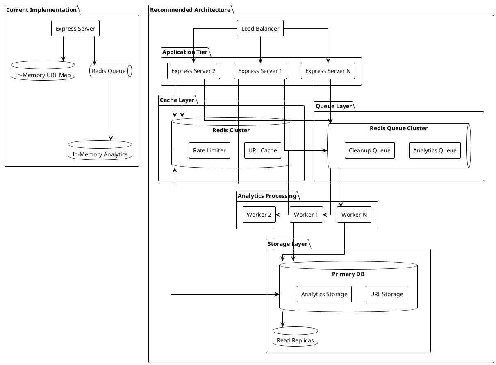

# Scalability Architecture

## Current Implementation vs Recommended Architecture



# AWS Scalability Architecture

```plantuml
@startuml
!include <awslib/AWSCommon>
!include <awslib/ApplicationIntegration/SQS/SQS>
!include <awslib/Compute/ElasticBeanstalk/ElasticBeanstalk>
!include <awslib/Database/RDS/RDS>
!include <awslib/Database/ElastiCache/ElastiCache>
!include <awslib/NetworkingContentDelivery/ElasticLoadBalancing/ElasticLoadBalancing>

' Define AWS components
ElasticLoadBalancing(alb, "Application Load Balancer", "distributes traffic")

rectangle "Application Tier" {
    ElasticBeanstalk(app1, "Express Server 1", "Node.js")
    ElasticBeanstalk(app2, "Express Server 2", "Node.js")
    ElasticBeanstalk(app3, "Express Server N", "Node.js")
}

ElastiCache(redis, "Redis Cluster", "caching & queues") {
    rectangle "Cache Nodes" {
        [Primary Cache]
        [Replica 1]
        [Replica 2]
    }
}

SQS(sqs, "Analytics Queue", "event processing") {
    rectangle "Workers" {
        [Worker 1]
        [Worker 2]
        [Worker N]
    }
}

RDS(rds, "Aurora Database", "storage") {
    database "Primary" {
        [Write Node]
    }
    database "Replicas" {
        [Read Node 1]
        [Read Node 2]
    }
}

' Define relationships
alb --> app1
alb --> app2
alb --> app3

app1 --> redis
app2 --> redis
app3 --> redis

app1 --> sqs
app2 --> sqs
app3 --> sqs

[Worker 1] --> rds
[Worker 2] --> rds
[Worker N] --> rds

[Write Node] --> [Read Node 1]
[Write Node] --> [Read Node 2]

@enduml
```

## Scalability Recommendations

### 1. Load Distribution
- **Load Balancer**
  - Distribute traffic across multiple Express instances
  - Health checks for high availability
  - SSL termination

### 2. Caching Layer
```typescript
interface CacheConfig {
  redis: {
    cluster: [
      { host: 'redis-1', port: 6379 },
      { host: 'redis-2', port: 6379 },
      { host: 'redis-3', port: 6379 }
    ],
    options: {
      maxRetriesPerRequest: 3,
      retryStrategy: (times: number) => Math.min(times * 1000, 30000)
    }
  }
}
```

### 3. Database Layer
```typescript
interface DBConfig {
  write: {
    host: 'primary-db',
    port: 5432
  },
  read: [
    { host: 'read-replica-1', port: 5432 },
    { host: 'read-replica-2', port: 5432 }
  ]
}
```

### 4. Queue Processing
```typescript
// Already implemented in your code, but scale with multiple workers
const analyticsQueue = new Queue('analytics', {
  redis: {
    host: process.env.REDIS_HOST,
    port: parseInt(process.env.REDIS_PORT || '6379')
  }
});

// Add worker scaling
const workerCount = parseInt(process.env.WORKER_COUNT || '3');
for (let i = 0; i < workerCount; i++) {
  analyticsQueue.process(async (job) => {
    // Your existing processing logic
  });
}
```

## Key Improvements

1. **Replace In-Memory Storage**
   - Move URL map to Redis cluster
   - Move analytics to persistent database

2. **Horizontal Scaling**
   - Multiple Express instances
   - Redis cluster for caching
   - Database read replicas

3. **Queue Processing**
   - Multiple worker processes
   - Partitioned queues
   - Dead letter queues

4. **Rate Limiting**
```typescript
import rateLimit from 'express-rate-limit';

const limiter = rateLimit({
  windowMs: 15 * 60 * 1000, // 15 minutes
  max: 100 // limit each IP to 100 requests per windowMs
});

app.use(limiter);
```

5. **Monitoring**
   - Queue size monitoring
   - Processing latency
   - Error rates
   - Resource utilization

## AWS Components

### Load Balancing
- Application Load Balancer
- Health checks & SSL termination
- Auto-scaling target groups

### Application Servers
- Elastic Beanstalk for Node.js
- Auto-scaling groups
- Multi-AZ deployment

### Caching Layer
- Amazon ElastiCache for Redis
- Multi-AZ replication
- Automatic failover

### Queue System
- Amazon SQS for analytics events
- Dead letter queues
- Auto-scaling workers

### Database
- Amazon Aurora
- Read replicas
- Automatic backups

## Implementation Priorities

1. **Phase 1: Basic Scaling**
   - Add Redis cluster for URL storage
   - Implement proper error handling
   - Add basic monitoring

2. **Phase 2: Performance**
   - Add caching layer
   - Implement rate limiting
   - Set up read replicas

3. **Phase 3: High Availability**
   - Add load balancer
   - Multiple Express instances
   - Queue worker scaling

4. **Phase 4: Monitoring**
   - Metrics collection
   - Alert system
   - Performance dashboards

## Implementation Phases

1. **Basic AWS Setup**
   - VPC configuration
   - IAM roles and policies
   - Basic monitoring with CloudWatch

2. **Application Migration**
   - Deploy to Elastic Beanstalk
   - Set up Auto Scaling
   - Configure load balancer

3. **Data Layer Setup**
   - ElastiCache cluster
   - Aurora database
   - SQS queues

4. **Monitoring & Alerts**
   - CloudWatch metrics
   - SNS notifications
   - X-Ray tracing